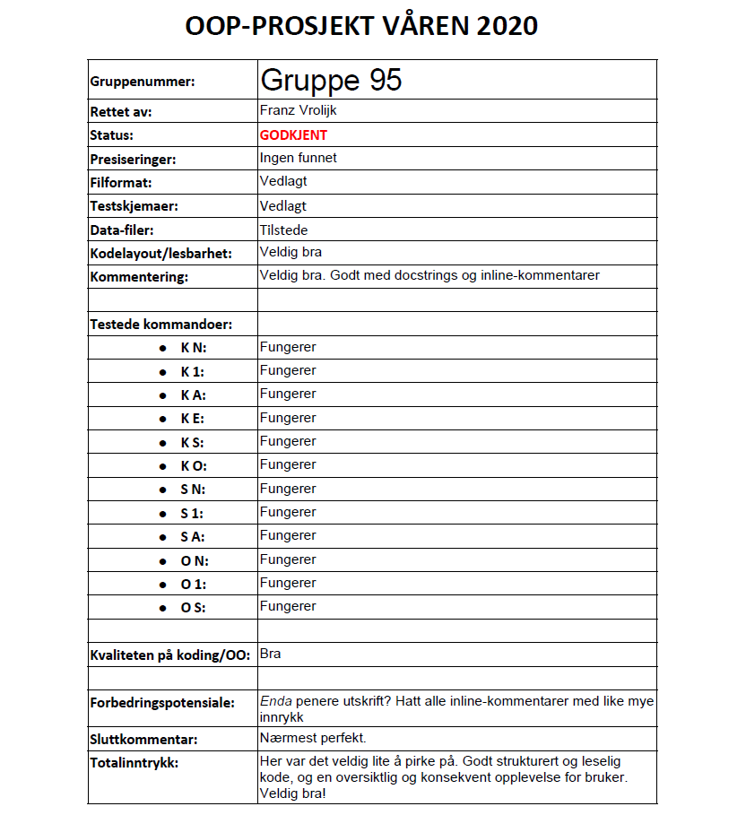

# PROG1003-Prosjekt

Prosjektoppgaven gikk ut på å lage et større program som holder orden på oppdrag/boliger (dvs. leiligheter og eneboliger) til salgs i ulike soner i en by/et geografisk område, samt potensielle kunder/kjøpere som har interesse for boliger i en eller flere av disse sonene. I hovedsakprogrammet håndterer programmet følgende operasjoner:
* Legge inn / skrive / slette / endre kunder/kjøpere
* Legge inn / skrive soner
* Legge inn / skrive / slette oppdrag/boliger (leiligheter/eneboliger)
* Skrive (til fil) oversikt over alle aktuelle boliger for en kunde
* Hele datastrukturen leses fra/skrives til filer

+
+
+
Tilbakemeldingen:
+
+

